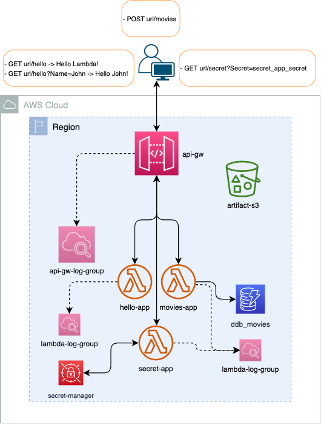
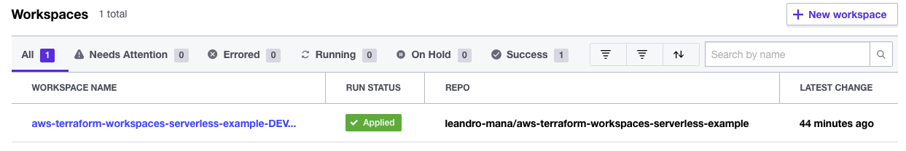
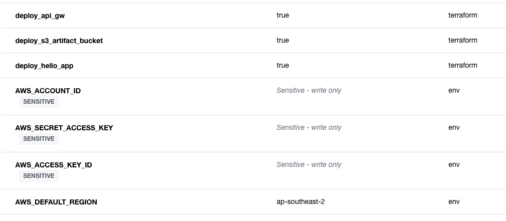
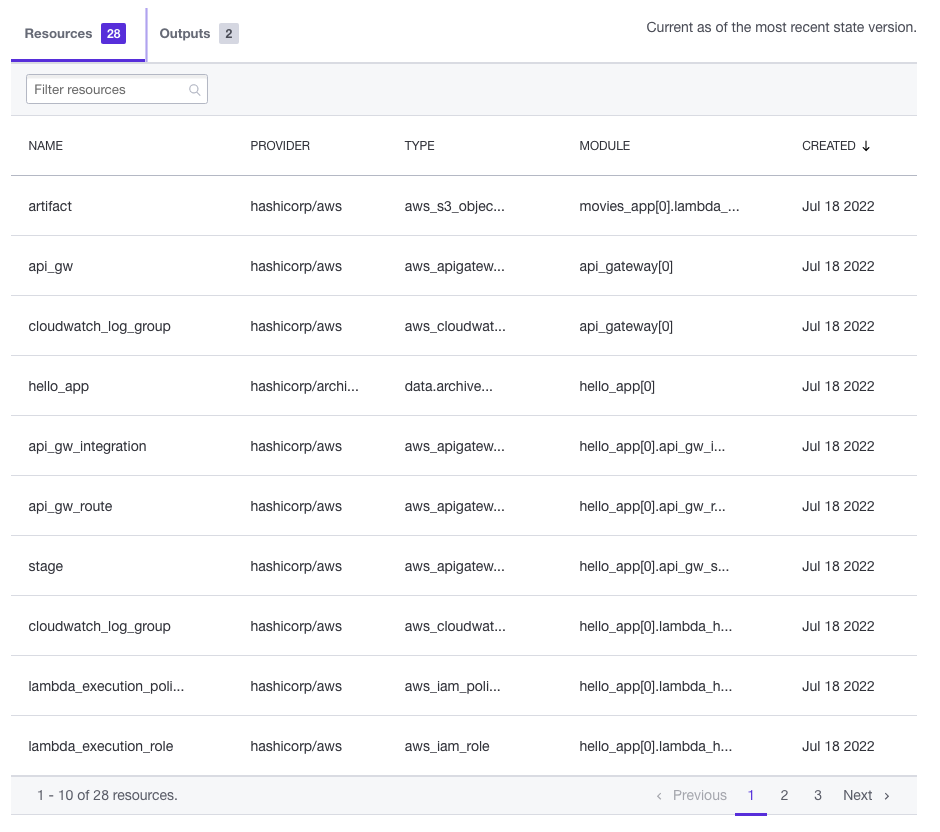
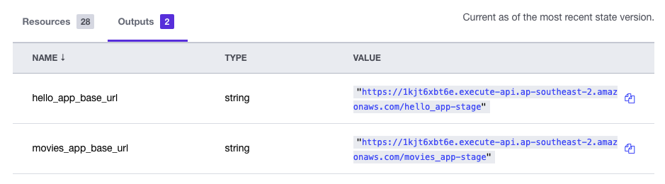
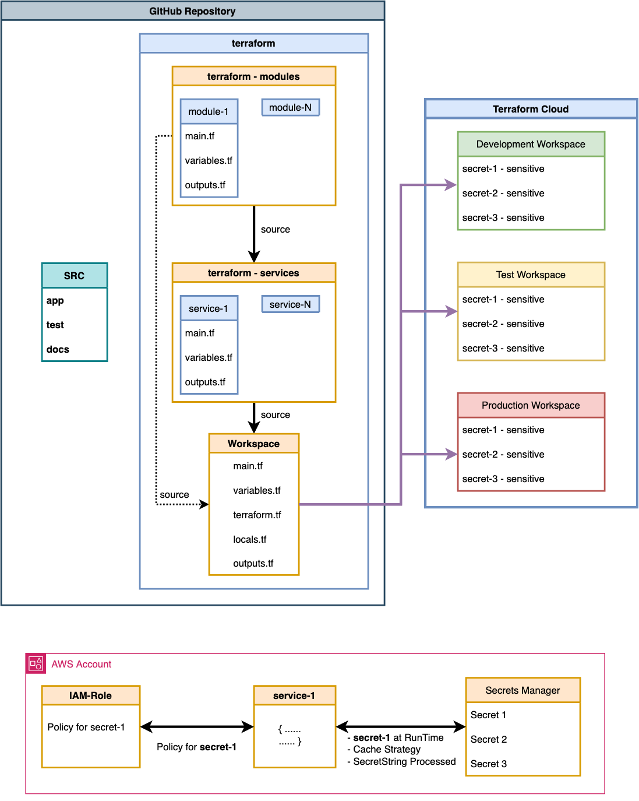

# AWS Terraform Workspaces ServerLess Example

The purpose of this repository is to provide an end-to-end AWS API ServerLess infrastructure, the infrastructure-as-code has been done with [Terraform](https://www.terraform.io/intro), coded in a modular way, whether to apply a [Workspaces](https://www.terraform.io/cloud-docs/workspaces) strategy or by using [Input Variables](https://www.terraform.io/language/values/variables) per each NonProd to Prod Environments, the AWS components are:
- [s3 bucket](https://registry.terraform.io/providers/hashicorp/aws/latest/docs/resources/s3_bucket) for storing the lambda artifacts
- [api_gateway](https://registry.terraform.io/providers/hashicorp/aws/latest/docs/resources/apigatewayv2_api) version 2:
    - Stage
    - Integration
    - Route
    - Cloudwatch log group
- [lambda](https://registry.terraform.io/providers/hashicorp/aws/latest/docs/resources/lambda_function) using Python:
    - IAM Role and Policy
    - Lambda Permission
    - Lambda Layer
    - Cloudwatch log group
- [Dynamo DB Table](https://docs.aws.amazon.com/amazondynamodb/latest/developerguide/Introduction.html)
- [Secrets Manager](https://aws.amazon.com/secrets-manager/)

The Infrastructure diagram:



The pattern used for the infrastructure as code is the following:

```YAML
terraform:
    - manifests: (generic independent from each other)
        - module_1:
            - main.tf
            - variables.tf
            - outputs.tf
        - module_2
        - module_N
    - services: (sourcing from manifests)
        - service_1:
            - main.tf (i.e. s3_module, ddb_module, etc)
            - variables.tf
            - outputs.tf
        - service_2:
            - main.tf (i.e. s3_module, glue_module, etc)
            - variables.tf
            - outputs.tf          
        - service_N
    - main.tf (source manifests AND/OR services)
    - variables.tf
    - terraform.tf
    - locals.tf
    - outputs.tf
```

- `IF` S3 Remote state is prefered, check [aws-terraform-serverless-example](https://github.com/leandro-mana/aws-terraform-serverless-example) which is a simpler variation of this solution by using S3 and DynamoDB, along with a Docker development environment to trigger all the targets from `Makefile`
- `ELSE`, the example on this repo is by creating a `Development Workspace` in [Terraform Cloud](https://www.terraform.io/cloud-docs), the code grouped into the terraform folder in a [modular](terraform/modules) way to simplify the variables declaration as well as common objects to be used along with the [services](terraform/services) definition. Each service, sources the manifests plus any other resource or data block needed for its domain of infrastructure that is self-defined, then at the root of the terraform folder a single [main.tf](terraform/main.tf) definition where all the infrastructure is pointed, and as an extra layer of modularity, individual flags variables are setup for each modular part of the infrastructure to be deployed in different Workspaces, for example the `Development` Workspaces might have all set to `true` for each service component, while on `Production` Workspace there might be still services not ready to be deployed, this allows to keep using the same `main.tf` definition but with different deployment results on each env.

**Requirements:**
- [Python3](https://docs.python-guide.org/starting/installation/)
- `GNU Make 4.3`
- [Terraform](https://learn.hashicorp.com/tutorials/terraform/install-cli) - OPTIONAL - to run the `make tf/fmt` target to format code.

- **SENSITIVE** Environment Variables to add in the Workspace:
    - `AWS_DEFAULT_REGION`: The AWS Account Default Region
    - `AWS_ACCESS_KEY_ID`: The AWS API Access Key ID  
    - `AWS_SECRET_ACCESS_KEY`: The AWS API Access Secret Key

## Local Setup and Test

Once the `Requirements` installed, follow bellow for a test execution flow:

```Bash
# Make Help Target Message
make [help]

# Python3 Virtual Environment
python -m venv .venv && source .venv/bin/activate
pip install --upgrade pip && pip install -r requirements.txt

# Install local modules
pip install src/lambda_layers/python/

# Run tests
make test

# - OPTIONAL - Terraform Formatter, if modifying the code
make tf/fmt
```

## Terraform Workspace Cloud Setup

Quick check on the Terraform Cloud documentation on [Create a Workspace](https://learn.hashicorp.com/tutorials/terraform/cloud-workspace-create), in this example the `aws-terraform-workspaces-serverless-example-DEVELOPMENT` have been created. The `Apply Method` is Manual, so after the `Plan` was successfully, the Apply was entered, obtaining below results.

- `Development Workspace Definition`


- `Workspace Variables`


- `Workspace Created Resources`


- `Workspace Outputs`


```Bash
# Terraform output like
hello_app_base_url = "https://<hash>.execute-api.<region>.amazonaws.com/hello_app-stage"
movies_app_base_url = "https://<hash>.execute-api.<region>.amazonaws.com/movies_app-stage"

# API invoke and output

## Hello App
curl "https://<hash>.execute-api.<region>.amazonaws.com/hello_app-stage/hello"
    
   OUTPUT -> "Hello Lambda!"

curl "https://<hash>.execute-api.<region>.amazonaws.com/hello_app-stage/hello?Name=Leo"

   OUTPUT -> "Hello Leo!"

## Movies App
curl -X POST "https://<hash>.execute-api.<region>.amazonaws.com/movies_app-stage/movies"

   OUTPUT -> {"message": "Successfully inserted data!"}

curl -X POST "https://<hash>.execute-api.<region>.amazonaws.com/movies_app-stage/movies" \
    --header 'Content-Type: application/json' \
    -d '{"year":1977, "title":"Starwars"}'

   OUTPUT -> {"message": "Successfully inserted data!"}

## Hello App
curl "https://<hash>.execute-api.<region>.amazonaws.com/secret_app-stage/secret?Secret=secret_app_secret"
    
   OUTPUT -> {"secret_app_key":"TOP-SECRET-VALUE"}

curl "https://<hash>.execute-api.<region>.amazonaws.com/secret_app-stage/secret?Secret=WRONG_SECRET"

  OUTPUT -> 'EXCEPTION RAISED'
```

This example can be extended to different `environments` by adding the respective `Terraform Workspace` pointing to [main.tf](terraform/main.tf) and adding the corresponding configuration for the variables and the flags for each App deployment, bellow is a picture that shows how to orchestrate the `Terraform` code along with the repository and also to emphasize the usage of the secrets by the following strategy:
- The secret is defined as a `sensitive` TF Variable
- The value of such variable is added in the `Terraform UI`
- The [secrets_manager](terraform/manifests/secrets_manager/main.tf) module, adds such value into Secrets Manager Service, and creates a policy ONLY for that specific secret
- The [secret_app](terraform/services/secret_app/main.tf) that uses the `secrets_manager` manifest, adds the IAM Policy ARN to be attached on its IAM Role.
- Resulting that only this specific service has access to only this specific secret. Such infra definition is simple to track and each service that needs to use secrets will follow similar standards.
- The [utils](src/lambda_layers/python/utils/) Python module has been coded to be deployed as a [AWS Lambda Layer](https://docs.aws.amazon.com/lambda/latest/dg/configuration-layers.html) and at the same time to be installed into the Python Virtual Environment for local development/testing.



The [mypy](http://mypy-lang.org/) and the [pytest](https://docs.pytest.org/) configuration is scalable for a real project, but the unit tests added into the [test](./test/) folder is to show how to store them along with the configuration but are just an example of assertions.

**NOTE:** `Destroy the Workspace`, follow along with [Terraform Documentation](https://learn.hashicorp.com/tutorials/terraform/cloud-destroy?in=terraform/cloud-get-started), Any action triggered on the Workspace will do a Plan first, and then based on the `Auto Apply` configuration will wait for approval.

**Contact:** [Leandro Mana](https://www.linkedin.com/in/leandro-mana-2854553b/)
